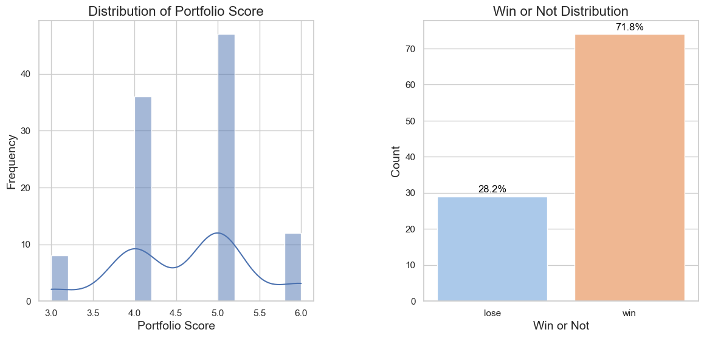

# GNN(Masked Language Model)을 활용한 분산투자 (Done)
---

## 목차 (Table of Contents)

1. [프로젝트 소개 (Introduction)](#프로젝트-소개-introduction)  
2. [분석 핵심 (Point)](#분석-핵심-point)  
3. [프로젝트 구조 (Project-Structure)](#프로젝트-구조-project-structure)

---

## 프로젝트 소개 (Introduction)
본 프로젝트는 빠르게 변화하는 시장 상황에서 **테마 기반 분산투자**를 자동화하기 위한 시도입니다.  
**GNN(Masked Language Model)** 기법을 활용해, 수작업으로 테마를 구성하던 한계를 극복하고 보다 효율적으로 테마를 생성·활용하고자 합니다.

---

## 분석 핵심 (Point)

- **목적**: 동적인 시장 환경에서 빠르게 테마를 만들고, 해당 테마에 기반한 분산투자를 효율적으로 수행
- **현재 서비스의 한계**  
  - 테마는 투자자의 의사결정을 직관적으로 돕고 분산투자를 용이하게 하지만, 대부분 사람이 수동으로 구성하고 있어 **시장 상황에 대한 즉각적 대응**이 어려움
- **가설**  
  - GNN을 통해 시장 상황을 모델링하고, **임베딩(Embedding) 값을 기반으로 군집화(Clustering)**를 진행한다면, **우수한 테마**를 구성할 수 있을 것
- **검증 방법**  
  - 군집화된 테마를 활용해 분산투자를 수행하고, **분산 효과**(상관관계·성과지표 등)가 잘 나타나는지 확인

---

## 프로젝트 구조 (Project-Structure)

1. **네트워크 구성**  
   - **노드 특성 선정**: GNN 모델에 사용할 노드(feature) 정의  
   - **엣지 구성**: 노드 간 **스필오버(spillover)** 값을 계산해 가중치(Weight)로 설정

2. **T-GNN 학습**  
   - 구성된 네트워크를 **T-GNN** 모델에 입력하여 **임베딩(Embedding)** 학습

3. **KNN 클러스터링**  
   - 학습된 네트워크 임베딩을 바탕으로 **KNN 클러스터링** 수행

4. **새로운 네트워크 구성**  
   - 클러스터링 결과(자산 군집, 테마)를 반영해 **새로운 네트워크** 구성

5. **포트폴리오 구성**  
   - 하나의 자산을 기준으로, **다른 테마** 이며 **네트워크 상에서 가장 멀리 떨어진** 자산들을 선택  
   - **동일가중 포트폴리오(equal-weight)** 로 편성

6. **성능 확인**  
   - 최종적으로 구성된 포트폴리오 및 모델의 **성과(Sharpe Ratio, MDD 등)** 를 평가  
   

```mermaid
flowchart LR
    A([데이터 제공<br>및 전처리]) --> B([네트워크 구성<br>노드 특성 + Spillover 엣지])
    B --> C([T-GNN<br>학습])
    C --> D([임베딩 -><br>KNN 클러스터링])
    D --> E([클러스터링<br>결과 기반<br>새로운 네트워크])
    E --> F([자산 선정 +<br>거리가 먼 자산 선택<br>-> 동일가중 포트폴리오])
    F --> G([모델 및 포트폴리오<br>성능 확인])
